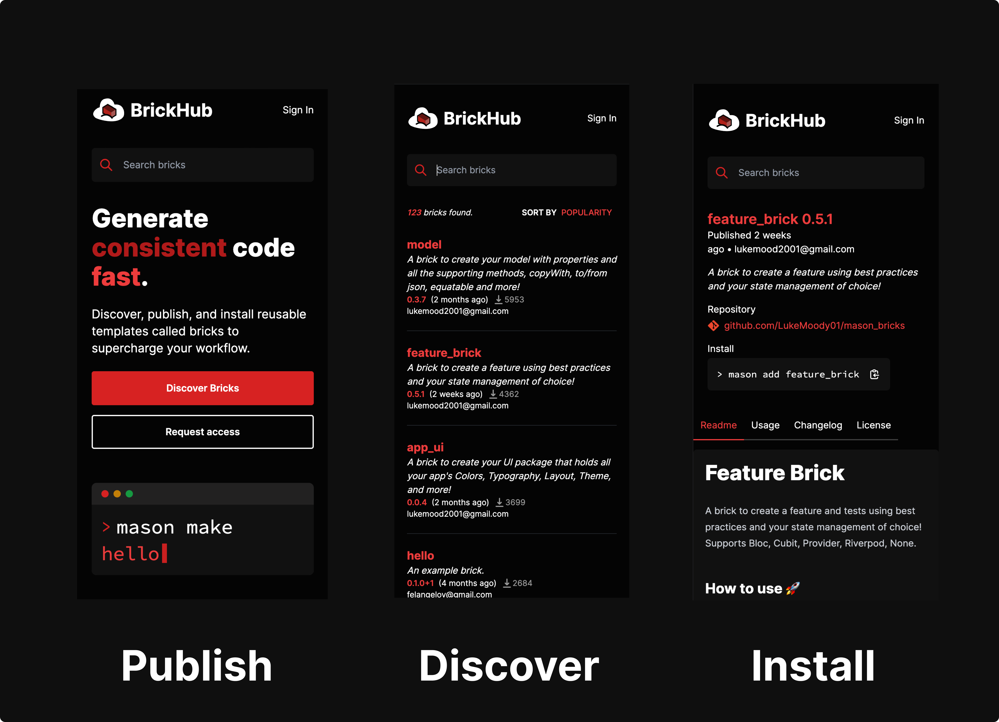

autoscale: true
footer: @felangelov - Flutter Vikings 2022
slidenumbers: true

# Meet Mason 🧱 ⛏

### Introduction to Templating & Custom Code Generation


### Felix Angelov @ Very Good Ventures 🦄

---

# About Me 🕶️🦄


### [https://verygood.ventures](https://verygood.ventures)

---

# Story Time 🧑‍🏫

- Joined a new team
- Assigned to a new feature


---

# Story Time 🧑‍🏫

- So I did what any developer would do...


---

# Story Time 🧑‍🏫

- And opened a pull request...


---

# Story Time 🧑‍🏫


- Rejected 🙅‍♂️
- I copied a "legacy" feature 😭

---

# Story Time 🧑‍🏫

[.column]

- 🗒 Back to square one...
- ⌛️ Lots of wasted time...
- 😤 Both sides frustrated...

[.column]


---

# The Problems

❓ Produce consistent code efficiently

❓ Code must be customizable

❓ Should be reusable and extensible

❓ Should be accessible to team/community

---

# Some Possible Solutions...

🧐 Copy + Paste

🧐 Gists

🧐 GitHub Templates

🧐 VSCode/IntelliJ Snippets

🧐 Custom Tooling (CLIs, IDE Extensions, etc.)

---

# Better Idea 🧠

- Spend the next year building a tool to automate this


---

# Meet Mason 👋


---

# Intro to Mason CLI 🧑‍💻

[.column]


[.column]

- Create and consume reusable templates called bricks 🧱
- Powered by Dart and Mustache 🎯 🥸
- Inspired by Stagehand, Yeoman, and Cookiecutter ✨

---

# Chapter 1: Getting Started 📕

- ☑️ Install Mason CLI
- ☑️ Initialize Mason in a Workspace
- ☑️ Install a brick
- ☑️ Use a brick

---

# Installing Mason 📦

```sh
# 🎯 Activate from https://pub.dev
dart pub global activate mason_cli

# 🍺 Install from https://brew.sh
brew tap felangel/mason
brew install mason
```

---

# Mason CLI Overview

[.column]

```sh
$ mason
🧱  mason • lay the foundation!

Usage: mason <command> [arguments]

Global options:
-h, --help       Print this usage information.
    --version    Print the current version.
```

[.column]

```
Available commands:
  add        Adds a brick from a local or remote source.
  bundle     Generates a bundle from a brick template.
  cache      Interact with mason cache.
  get        Gets all bricks in the nearest mason.yaml.
  init       Initialize mason in the current directory.
  list       Lists installed bricks.
  login      Log into brickhub.dev.
  logout     Log out of brickhub.dev.
  make       Generate code using an existing brick template.
  new        Creates a new brick template.
  publish    Publish the current brick to brickhub.dev.
  remove     Removes a brick.
  search     Search published bricks on brickhub.dev.
  unbundle   Generates a brick template from a bundle.
  update     Update mason.
  upgrade    Upgrade bricks to their latest versions.

Run "mason help <command>" for more information about a command.
```

---

# Chapter 1: Checkpoint 📕 🏁

- ✅ Install Mason CLI
- ☑️ Initialize Mason in a Workspace
- ☑️ Install a brick
- ☑️ Use a brick

---

# `$ mason init` 📁

**Create a locally scoped workspace for working with bricks**

- initializes mason in the current directory
  - generates a `mason.yaml`
- allows you to work with locally scoped bricks

---

# `$ mason init` in action

```sh
$ mason init
✓ Initializing (47ms)
✓ Getting bricks (10ms)
✓ Generated 1 file(s):
  /me/mason_playground/mason.yaml (new)

Run "mason make hello" to use your first brick.
```

---

# Anatomy of the `mason.yaml`

**Defines the available bricks for a specific workspace**

- similar to `pubspec.yaml`
- defines bricks instead of dependencies
- mason will always use the nearest parent `mason.yaml`

---

# The generated `mason.yaml`

```yaml
# Register bricks which can be consumed via the Mason CLI.
# https://github.com/felangel/mason
bricks:
  # Sample Brick
  # Run `mason make hello` to try it out.
  hello: "0.1.0+1"
  # Bricks can also be imported via git url.
  # Uncomment the following lines to import
  # a brick from a remote git url.
  # widget:
  #   git:
  #     url: https://github.com/felangel/mason
  #     path: bricks/widget
```

---

# Chapter 1: Checkpoint 📕 🏁

- ✅ Install Mason CLI
- ✅ Initialize Mason in a Workspace
- ☑️ Install a brick
- ☑️ Use a brick

---

# `$ mason get` ☁️

**Install all bricks registered in the nearest parent `mason.yaml`**

- Analogous to `dart pub get`
- Generated `mason-lock.json`
- Bricks are cached locally for offline use
  - add `.mason` to `.gitignore`

---

# `$ mason get` in action

[.column]

```sh
$ mason get
✓ Getting bricks (22ms)
```

[.column]

[.code-highlight: 2-3]

```
├── .mason
├── mason-lock.json
└── mason.yaml
```

---

# `$ mason list` 🗒

**List all installed bricks`**

- Use `mason ls` shorthand
- Outputs installed bricks
- Defaults to locally installed bricks
- Use `--global` or `-g` for globally installed bricks

---

# `$ mason list` in action

```sh
$ mason list
/me/mason_playground
└── hello 0.1.0+1 -> registry.brickhub.dev
```

---

# `$ mason list` in action

```sh
# Change to a directory outside the workspace
$ cd /me/dart_playground

# List available bricks
$ mason ls
/me/dart_playground
└── (empty)
```

---

# Chapter 1: Checkpoint 📕 🏁

- ✅ Install Mason CLI
- ✅ Initialize Mason in a Workspace
- ✅ Install a brick
- ☑️ Use a brick

---

# `$ mason make` 🚧

**Generate code from a brick**

- looks up brick metadata
- prompts for any required variables
- generates code in the desired output directory

---

# `$ mason make` in action

```sh
$ mason make hello
? What is your name? (Dash)
```

---

# `$ mason make` in action

[.column]

```sh
$ mason make hello
? What is your name? (Dash) Felix
✓ Made brick hello (52ms)
✓ Generated 1 file:
  /me/mason_playground/HELLO.md (new)
```

---

# What's inside `HELLO.md` 👀

```md
Hello Felix! 👋
```

---

# `$ mason make` w/command-line args 🧑‍💻

```sh
$ mason make hello --name Felix
✓ Made brick hello (41ms)
✓ Generated 1 file:
  /me/mason_playground/HELLO.md (identical)
```

---

# `$ mason make` w/config file 📝

_config.json_

```json
{
  "name": "Felix"
}
```

```sh
$ mason make hello -c config.json
✓ Made brick hello (41ms)
✓ Generated 1 file:
  /me/mason_playground/HELLO.md (identical)
```

---

# `$ mason make` w/custom output directory 🗂

```sh
$ mason make hello --name Felix -o ./out
✓ Made brick hello (41ms)
✓ Generated 1 file:
  /me/mason_playground/out/HELLO.md (new)
```

---

# `$ mason make` conflicts ❗️

```sh
$ mason make hello --name Dash
conflict /me/mason_playground/HELLO.md
Overwrite HELLO.md? (Yyna)
```

---

# `$ mason make` conflicts ❗️

```sh
$ mason make hello --name Dash
conflict /me/mason_playground/HELLO.md
Overwrite HELLO.md? (Yyna) y
✓ Made brick hello (32.5s)
✓ Generated 1 file:
  /me/mason_playground/HELLO.md (new)
```

---

# The updated `HELLO.md` ✨

```md
Hello Dash! 👋
```

---

# Conflict Resolution Strategies

**By default, `mason` will prompt on each file conflict**

Options:

- y - yes, overwrite (default)
- Y - yes, overwrite this and all others
- n - no, do not overwrite
- a - append to existing file

---

# `$ mason make` w/conflict resolution

```sh
# ❓ Always prompt when there is a file conflict (default)
$ mason make hello --name Dash --on-conflict prompt

# 🖊 Always overwrite when there is a file conflict
$ mason make hello --name Dash --on-conflict overwrite

# ✌️ Always skip when there is a file conflict
$ mason make hello --name Dash --on-conflict skip

# ➕ Always append when there is a file conflict
$ mason make hello --name Dash --on-conflict append
```

---

# Chapter 1 Complete 📕 🥳

- ✅ Install Mason CLI
- ✅ Initialize Mason in a Workspace
- ✅ Install a brick
- ✅ Use a brick

---

# Chapter 1 Summary 📕 📝

```
# 🎯 Activate from https://pub.dev
$ dart pub global activate mason_cli

# 📁 Initialize mason in the current workspace
$ mason init

# ☁️ Install all bricks defined in `mason.yaml`
$ mason get

# 🚧 Generate code from a brick
$ mason make hello
```

---

# Chapter 2: Creating a Brick 📗

- ☑️ Generating a new brick
- ☑️ Anatomy of a brick
- ☑️ Brick template syntax
- ☑️ Hooks

---

# `$ mason new` ⛏

**Create a new brick template**

- creates a brick in the current directory
  - generates a `brick.yaml`
  - generates a `__brick__` directory
- includes `README`, `LICENSE`, and `CHANGELOG`

---

# `$ mason new` in action

```sh
$ mason new example
✓ Created new brick: example (74ms)
✓ Generated 5 file(s):
  /me/mason_playground/example/brick.yaml (new)
  /me/mason_playground/example/README.md (new)
  /me/mason_playground/example/CHANGELOG.md (new)
  /me/mason_playground/example/LICENSE (new)
  /me/mason_playground/example/__brick__/HELLO.md (new)
```

---

# Chapter 2: Checkpoint 📕 🏁

- ✅ Generating a new brick
- ☑️ Anatomy of a brick
- ☑️ Brick template syntax
- ☑️ Hooks

---

[.code-highlight: 5-6]

# Anatomy of a Brick 🧱

[.column]

```
.
├── CHANGELOG.md
├── LICENSE
├── README.md
├── __brick__
└── brick.yaml
```

[.column]

- **`__brick__`**
  - brick template
- **`brick.yaml`**
  - brick metadata (`pubspec.yaml`)

---

# Anatomy of the `brick.yaml`

**Defines the metadata for a specific brick**

[.column]

```yaml
name: example
description: An example brick
version: "0.1.0+1"

environment:
  mason: ">=0.1.0-dev <0.1.0"

vars:
  name:
    type: string
    description: Your name.
    default: Dash
    prompt: What is your name?
```

[.column]

- can contain zero or more variables
- variable types include:
  - `string`, `number`, `boolean`, `enum`, `array`

---

# Variable Type: `array`

[.column]

```yaml
vars:
  flavors:
    type: array
    description: Supported flavors
    prompt: What flavors would you like to generate?
    defaults:
      - development
      - production
    values:
      - development
      - integration
      - staging
      - production
```

[.column]

```
$ mason make example
? What flavors would you like to generate?
❯ ◉  development
  ◯  integration
  ◯  staging
  ◉  production
```

---

# Variable Type: `enum`

[.column]

```yaml
vars:
  license:
    type: enum
    default: MIT license
    prompt: "Choose a License:"
    values:
      - "Apache License 2.0"
      - 'BSD 3-Clause "New" or "Revised" license'
      - "GNU General Public License (GPL)"
      - "MIT license"
      - "Mozilla Public License 2.0"
```

[.column]

```
$ mason make example
? Choose a License:
  ◯  Apache License 2.0
  ◯  BSD 3-Clause "New" or "Revised" license
  ◯  GNU General Public License (GPL)
❯ ◉  MIT license
  ◯  Mozilla Public License 2.0
```

---

[.code-highlight: 5-7]

# Putting it Together 🧩

[.column]

```
.
├── CHANGELOG.md
├── LICENSE
├── README.md
├── __brick__
│   └── HELLO.md
└── brick.yaml
```

[.column]

##### `__brick__/HELLO.md`

```md
Hello {{name}}! 👋
```

##### `brick.yaml`

```yaml
name: hello
description: An example brick
version: "0.1.0+1"

vars:
  name:
    type: string
    description: Your name.
    prompt: What is your name?
```

[.column]

```sh
$ mason make hello
? What is your name? Viking
```

##### `HELLO.md`

```md
Hello Viking! 👋
```

---

# Chapter 2: Checkpoint 📕 🏁

- ✅ Generating a new brick
- ✅ Anatomy of a brick
- ☑️ Brick template syntax
- ☑️ Hooks

---

# Template Syntax

- mustache using:
  - `package:mustache_template`
- refer to mustache spec:
  - https://mustache.github.io/mustache.5.html

---

# Template Syntax: Conditionals

[.column]

##### `__brick__/pubspec.yaml`

```yaml
{{^publish}}
publish_to: none
{{/publish}}

dependencies:
  flutter:
    sdk: flutter

  {{#useGoogleFonts}}
  google_fonts: latest
  {{/useGoogleFonts}}
```

[.column]

```json
{
  "publish": false,
  "useGoogleFonts": true
}
```

##### `pubspec.yaml`

```yaml
publish_to: none

dependencies:
  flutter:
    sdk: flutter

  google_fonts: latest
```

---

# Template Syntax: Loops

[.column]

##### `__brick__/README.md`

```md
{{#platforms}}

- {{.}}
  {{/platforms}}
```

[.column]

```json
{
  "platforms": ["iOS", "Android", "Web"]
}
```

##### `README.md`

```md
- iOS
- Android
- Web
```

---

# Template Syntax: Lambdas

**Functions that can be used to manipulate rendered text**

- Standard Syntax: `{{#upperCase}}{{name}}{{/upperCase}}`

- Shorthand: `{{name.upperCase()}}`

---

# Built-in Lambdas

| Name           | Example             | Shorthand Syntax              | Full Syntax                                      |
| -------------- | ------------------- | ----------------------------- | ------------------------------------------------ |
| `camelCase`    | `helloWorld`        | `{{variable.camelCase()}}`    | `{{#camelCase}}{{variable}}{{/camelCase}}`       |
| `constantCase` | `HELLO_WORLD`       | `{{variable.constantCase()}}` | `{{#constantCase}}{{variable}}{{/constantCase}}` |
| `dotCase`      | `hello.world`       | `{{variable.dotCase()}}`      | `{{#dotCase}}{{variable}}{{/dotCase}}`           |
| `headerCase`   | `Hello-World`       | `{{variable.headerCase()}}`   | `{{#headerCase}}{{variable}}{{/headerCase}}`     |
| `lowerCase`    | `hello world`       | `{{variable.lowerCase()}}`    | `{{#lowerCase}}{{variable}}{{/lowerCase}}`       |
| `mustacheCase` | `{{ Hello World }}` | `{{variable.mustacheCase()}}` | `{{#mustacheCase}}{{variable}}{{/mustacheCase}}` |
| `pascalCase`   | `HelloWorld`        | `{{variable.pascalCase()}}`   | `{{#pascalCase}}{{variable}}{{/pascalCase}}`     |
| `paramCase`    | `hello-world`       | `{{variable.paramCase()}}`    | `{{#paramCase}}{{variable}}{{/paramCase}}`       |
| `pathCase`     | `hello/world`       | `{{variable.pathCase()}}`     | `{{#pathCase}}{{variable}}{{/pathCase}}`         |
| `sentenceCase` | `Hello world`       | `{{variable.sentenceCase()}}` | `{{#sentenceCase}}{{variable}}{{/sentenceCase}}` |
| `snakeCase`    | `hello_world`       | `{{variable.snakeCase()}}`    | `{{#snakeCase}}{{variable}}{{/snakeCase}}`       |
| `titleCase`    | `Hello World`       | `{{variable.titleCase()}}`    | `{{#titleCase}}{{variable}}{{/titleCase}}`       |
| `upperCase`    | `HELLO WORLD`       | `{{variable.upperCase()}}`    | `{{#upperCase}}{{variable}}{{/upperCase}}`       |

---

# Lambdas in Action: Widget

**`__brick__/{{name.snakeCase()}}.dart`**

```dart
import 'package:flutter/widgets.dart';

class {{name.pascalCase()}} extends StatelessWidget {
  const {{name.pascalCase()}}({super.key});

  @override
  Widget build(BuildContext context) {
    return const SizedBox();
  }
}
```

---

# Template Syntax: Partials

**Nested Templates within other templates**

[.column]

```
__brick__
  ├── HELLO.md
  ├── {{~ footer.md }}
  └── {{~ header.md }}
```

[.column]

##### {{~ header.md }}

```md
# 🧱 {{name}}
```

##### {{~ footer.md }}

```md
_made with 💖 by mason_
```

[.column]

##### HELLO.md

```md
{{> header.md }}

Hello {{name}}!

{{> footer.md }}
```

---

# Chapter 2: Checkpoint 📕 🏁

- ✅ Generating a new brick
- ✅ Anatomy of a brick
- ✅ Brick template syntax
- ☑️ Hooks

---

# Hooks 🪝

**Custom code that executes before or after generation**

[.column]

`$ mason new example --hooks`

[.column]
[.code-highlight: 8-12]

```
.
├── CHANGELOG.md
├── LICENSE
├── README.md
├── __brick__
│   └── HELLO.md
├── brick.yaml
└── hooks
    ├── .gitignore
    ├── post_gen.dart
    ├── pre_gen.dart
    └── pubspec.yaml
```

---

# Hooks Example: `pre_gen.dart`

```dart
// pre_gen.dart
import 'dart:io';
import 'package:mason/mason.dart';

void run(HookContext context) {
  // Use the `Logger` instance.
  context.logger.info('hello from pre_gen.dart!');

  // Read vars.
  final name = context.vars['name'];

  // Update vars.
  context.vars['current_year'] = DateTime.now().year;
}
```

---

# Hooks Example: `post_gen.dart`

```dart
// post_gen.dart
import 'dart:io';
import 'package:mason/mason.dart';

Future<void> run(HookContext context) async {
  final progress = context.logger.progress('Installing packages');

  // Run `flutter packages get` after generation.
  await Process.run('flutter', ['packages', 'get']);

  progress.complete();
}
```

---

# Chapter 2 Complete 📕 🥳

- ✅ Generating a new brick
- ✅ Anatomy of a brick
- ✅ Brick template syntax
- ✅ Hooks

---

# Chapter 3: Brick Management 📘

- ☑️ Intro to BrickHub
- ☑️ Adding / Removing bricks
- ☑️ Upgrading bricks

---

[.background-color: #0f0f0f]
[.text: #ffffff]
[.header: #ffffff]



---

# Chapter 3: Checkpoint 📘 🏁

- ✅ Intro to BrickHub
- ☑️ Searching for bricks
- ☑️ Adding / Removing bricks

---

# Brick Search 🔎

```sh
$ mason search "very good ventures"
✓ Found 5 bricks. (0.3s)

very_good_dart_package v0.0.1
A Very Good Dart package created by Very Good Ventures.
https://brickhub.dev/bricks/very_good_dart_package/0.0.1
--------------------------------------------------------------------------------
very_good_flutter_package v0.0.1
A Very Good Flutter package created by Very Good Ventures.
https://brickhub.dev/bricks/very_good_flutter_package/0.0.1
--------------------------------------------------------------------------------
very_good_core v0.0.1
A Very Good Flutter app created by Very Good Ventures.
https://brickhub.dev/bricks/very_good_core/0.0.1
--------------------------------------------------------------------------------
very_good_flutter_plugin v0.0.1
A Very Good federated Flutter plugin created by Very Good Ventures.
https://brickhub.dev/bricks/very_good_flutter_plugin/0.0.1
--------------------------------------------------------------------------------
very_good_dart_cli v0.0.1
A Very Good Dart CLI created by Very Good Ventures.
https://brickhub.dev/bricks/very_good_dart_cli/0.0.1
--------------------------------------------------------------------------------
```

---

# Chapter 3: Checkpoint 📘 🏁

- ✅ Intro to BrickHub
- ✅ Searching for bricks
- ☑️ Adding / Removing bricks

---

# Adding Bricks to Workspace 🗃

```sh
# Install example from path
$ mason add example --path ./example
```

##### `mason.yaml`

```yaml
bricks:
  example:
    path: ./example
```

---

# Adding Bricks to Workspace 🗃

```sh
# Install widget from git
$ mason add widget
  --git-url https://github.com/felangel/mason
  --git-path bricks/widget
```

##### `mason.yaml`

```yaml
bricks:
  widget:
    git:
      url: https://github.com/felangel/mason
      path: bricks/widget
```

---

# Adding Bricks to Workspace 🗃

```sh
# Install amplify_starter from https://brickhub.dev
$ mason add amplify_starter
```

##### `mason.yaml`

```yaml
bricks:
  amplify_starter: ^0.2.2
```

---

# Let's List 'em 🗒

```sh
$ mason ls
/me/mason_playground
├── amplify_starter 0.2.2 -> registry.brickhub.dev
├── example 0.1.0+1 -> /me/mason_playground/example
└── widget 0.1.0+1 -> https://github.com/felangel/mason
```

```sh
$ cd /me/dart_playground
$ mason ls
/me/dart_playground
└── (empty)
```

---

# Adding Bricks Globally 🌎

**Globally installed bricks can be used from anywhere on your machine**

```sh
# Install example from path
$ mason add -g example --path ./example

# Install widget from git
$ mason add -g widget
  --git-url https://github.com/felangel/mason
  --git-path bricks/widget

# Install amplify_starter from https://brickhub.dev
$ mason add -g amplify_starter
```

---

# Listing Global Bricks 🌎

```sh
$ cd /me/dart_playground

$ mason ls
/me/dart_playground
└── (empty)

$ mason ls -g
/me/.mason-cache/global
├── amplify_starter 0.2.2 -> registry.brickhub.dev
├── example 0.1.0+1 -> /me/mason_playground/example
└── widget 0.1.0+1 -> https://github.com/felangel/mason
```

---

# Removing Bricks 🗑

```sh
# Remove local brick
$ mason remove example
✓ Removed example (22ms)

# Remove global brick
$ mason remove -g widget
✓ Removed widget (21ms)
```

---

# Chapter 3: Complete 📘 🥳

- ✅ Intro to BrickHub
- ✅ Searching for bricks
- ✅ Adding / Removing bricks

---

# Chapter 4: Publishing Bricks 📙

- ☑️ Signing up
- ☑️ Logging in
- ☑️ Publishing a brick
- ☑️ Logging out

---

# IDE Integration ⚡️

---

# Community Bricks 🌟

---

# Finally... 💥

**When a new teammate joins and picks up a new feature**

```sh
$ mason make feature_brick
? What is the feature name? login
✓ Made brick feature_brick (0.3s)
✓ Generated 8 file(s):
  /me/mason_playground/my_app/lib/login/widgets/login_body.dart (new)
  /me/mason_playground/my_app/lib/login/view/login_page.dart (new)
  /me/mason_playground/my_app/lib/login/bloc/login_event.dart (new)
  /me/mason_playground/my_app/lib/login/bloc/login_state.dart (new)
  /me/mason_playground/my_app/lib/login/widgets/widgets.dart (new)
  /me/mason_playground/my_app/lib/login/login.dart (new)
  /me/mason_playground/my_app/lib/login/bloc/bloc.dart (new)
  /me/mason_playground/my_app/lib/login/bloc/login_bloc.dart (new)
```

---

# Let's Recap

✅ Produce consistent code efficiently

✅ Code must be customizable

✅ Should be reusable and extensible

✅ Should be accessible to team/community

---

# Roadmap 🗺

- Multiple Template Engine Support
- Template Extensions
- Multiple Publishers
- IntelliJ Plugin

---

# Thank You!

# 🙏

### Twitter @felangelov

### GitHub @felangel

---

# New Features

- https://brickhub.dev/bricks/feature_brick
- https://brickhub.dev/bricks/model
- https://brickhub.dev/bricks/service
- https://brickhub.dev/bricks/app_ui

---

# New Packages

- https://brickhub.dev/bricks/very_good_dart_package
- https://brickhub.dev/bricks/very_good_flutter_package
- https://brickhub.dev/bricks/app_ui
- https://brickhub.dev/bricks/widgetbook_starter

---

# New Applications

- https://brickhub.dev/bricks/very_good_core
- https://brickhub.dev/bricks/very_good_dart_cli
- https://brickhub.dev/bricks/amplify_starter
- https://brickhub.dev/bricks/flutterfire_starter
- https://brickhub.dev/bricks/macosui_starter
